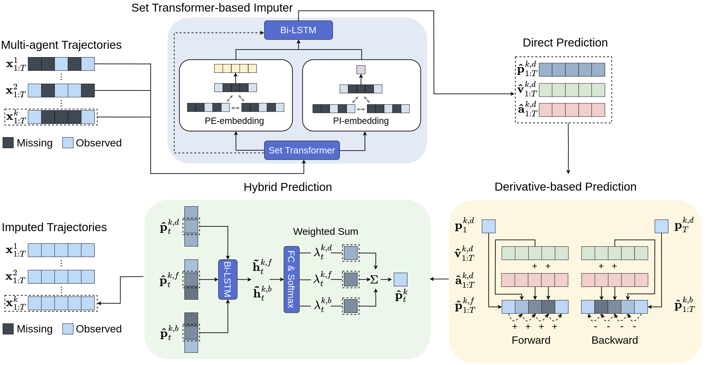
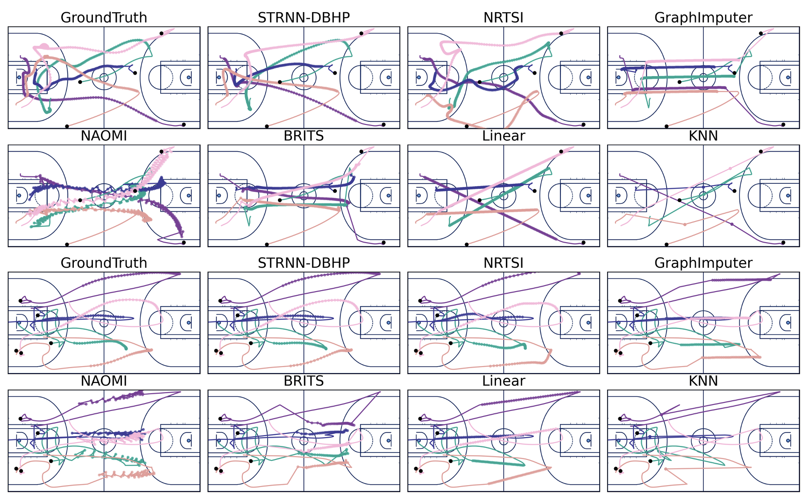
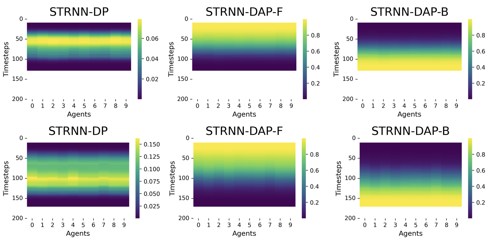

<div align="center">
	<h1>
		Hybrid Imputation
	</h1>
</div>
The code corresponding to the paper “Multi-Agent Trajectory Imputation Using Derivative-based Hybrid Prediction." 

The code is written with PyTorch v1.9.0 (Python 3.8.18).

<br>

## Setup
1. **Clone this repository using the following command:**
    
    ```bash
    $ git clone https://github.com/gkswns95/hybrid-imputation.git
    ```
2. **Installation requirements using the following command:**

    ```bash
    $ pip install -r requirments.txt
    ```
## Data Usage
We have utilized three real-world sports multi-agent trajectory datasets, including Soccer (Metrica), Basketball (NBA), and American Football (NFL). Each dataset can be downloaded from the following link: [Google Drive](https://drive.google.com/drive/u/0/folders/1QzaSsOVq4bccs90UjCS0-TJwvgxjErZn).

- **Soccer Dataset (Metrica)**
    - The soccer data is provided by [Metrica Sports](https://metrica-sports.com). It includes trajectories for 22 players across 3 matches, sampled at 25Hz. We have downsampled the data to 10Hz and set a sequence length of 200, corresponding to 20 seconds of gameplay. The data preprocessing code is implemented in `datatools/metrica_data_processing.ipynb`, and the processed data used in our experiments can be downloaded from the Google Drive link provided above.
- **Basketball Dataset (NBA)**
    - The basketball data is provided by [NBA-Player-Movements](https://github.com/linouk23/NBA-Player-Movements). It contains trajectories for 10 players across 631 matches, sampled at 25Hz. To align the total frames with other datasets, we selected 100 matches for training/validation/testing data. We have also downsampled the sampling rate to 10Hz and set a sequence length of 200, consistent with the Metrica data. The preprocessing code is implemented in `datatools/nba_data_processing.ipynb`. The data used in our experiments can be downloaded from the Google Drive link provided above.
- **American Football (NFL)**
    - The American football data is provided by [2021 Big Data Bowl data](https://www.kaggle.com/c/nfl-big-data-bowl-2021). It consists of trajectories for 6 offensive players with a sampling rate of 10Hz. Note that this data is utilized in **NRTIS**, which serves as our baseline. Therefore, for a fair comparison, we adopted the same settings as NRTIS, such as the sampling rate and sequence length. Consequently, we set the sequence length to 50 with a sampling rate of 10Hz. To convert the original data into our dataset format, we have implemented the data processing code, which can be found in `datatools/nfl_data_processing.ipynb`. The data utilized in our experiments can be downloaded from the Google Drive link provided above.

## Running the Code
1. **Training**
    
    Training command for **STRNN-DBHP-D** model for each dataset:
    
    ```bash
    # Training model on "soccer(Metrica)" dataset
    $ sh script dbhp_soccer.sh
    # Training model on "basketball(NBA)" dataset
    $ sh script dbhp_basketball.sh
    # Training model on "american football(NFL)" dataset
    $ sh script dbhp_afootball.sh
    ```
    
2. **Evaluating**
    
    After training the model, please run the `model_eval.ipynb` code to evaluate the model performance.

## Plotting the Imputed Trajectories
We have also implemented code for analyzing model performance by visualizing imputed trajectories. After running the evaluation code, please execute the “Performance Analysis” code block in the `model_eval.ipynb` notebook.

- **Animating**
    - This code is for animating imputed trajectories. You should run the evaluating code first. The ground-truth of the players' trajectories is represented as circles with numbers, whereas the imputed trajectories are represented as circles with bounding boxes. Additionally, the numbers on top of the bounding boxes indicate the error between the correct and predicted trajectories, calculated as the L2-distance.
      - Example of animation result (Soccer)
      	<br>

- **Plotting trajectories imputed by each model**
	- Examples of the visualized imputed trajectories for each model are provided. A black dot represents the first frame of the sequence 	data, a solid line shows the complete trajectories which include both observed and imputed trajectories, and a circle with light-colored dots signifies the missing trajectories that each model has imputed.
		- Example of imputed trajectories (Basketball)
		<br>

- **Plotting dynamic weights assigned on each model (STRNN-DP, STRNN-DAP-F, STRNN-DAP-B)**
  	- Example of the dynamic weights for our STRNN-DBHP-D model
	<br>
