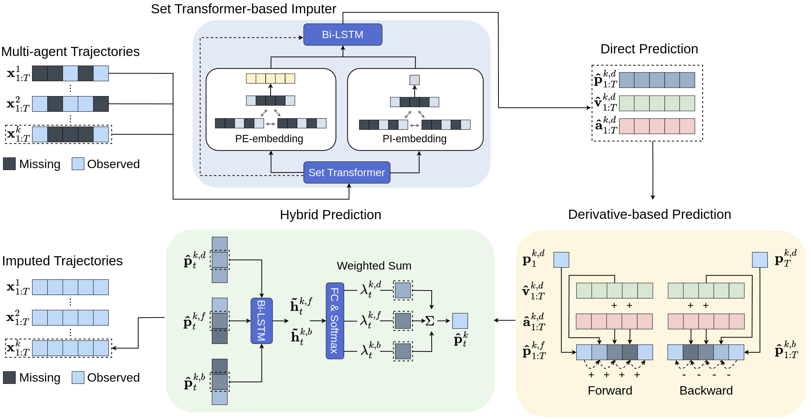
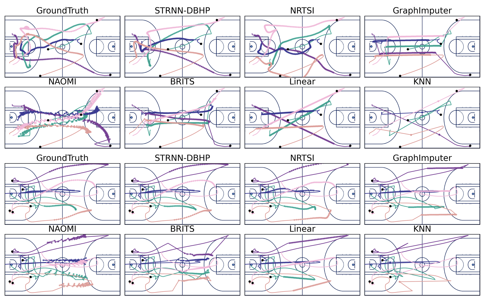
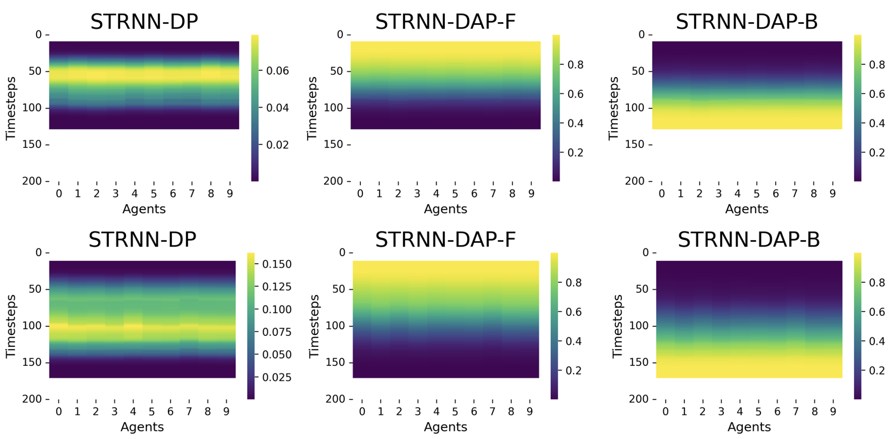

<div align="center">
	<h1>
		Hybrid Imputation
	</h1>
</div>
The code corresponding to the paper “Multi-Agent Trajectory Imputation Using Derivative-based Hybrid Prediction." 

The code is written with PyTorch v1.10.1 (Python 3.8.18).

<br>

## Setup
1. **Clone this repository using the following command:**
    
    ```bash
    $ git clone https://github.com/gkswns95/hybrid-imputation.git
    ```
2. **Install the `requirements.txt` file using the following command:**

    ```bash
    $ pip install -r requirements.txt
    ```
## Data Usage
We have utilized three real-world sports multi-agent trajectory datasets, including Soccer (Metrica), Basketball (NBA), and American Football (NFL). Each dataset can be downloaded from the following link: [Google Drive](https://drive.google.com/drive/folders/1QzaSsOVq4bccs90UjCS0-TJwvgxjErZn?usp=sharing). After downloading the `data` folder from Google Drive, you should then place it under the `hybrid-imputation` project folder. Please note that all datasets uploaded to Google Drive have already been preprocessed according to our experimental settings. The settings for each dataset are as follows:

- **Soccer Dataset (Metrica)**
    - The soccer data is provided by [Metrica Sports](https://metrica-sports.com/). It includes trajectories for 22 players across 3 matches, sampled at 25Hz. We have downsampled the data to 10Hz and set a sequence length of 200, corresponding to 20 seconds of gameplay.
- **Basketball Dataset (NBA)**
    - The basketball data is provided by [NBA-Player-Movements](https://github.com/linouk23/NBA-Player-Movements). It contains trajectories for 10 players across 631 matches, sampled at 25Hz. To align the total frames with other datasets, we selected 100 matches for training/validation/testing data. We have also downsampled the sampling rate to 10Hz and set a sequence length of 200, consistent with the Metrica data.
- **American Football (NFL)**
    - The American football data is provided by [2021 Big Data Bowl data](https://www.kaggle.com/c/nfl-big-data-bowl-2021). It consists of trajectories for 6 offensive players with a sampling rate of 10Hz. Note that this data is utilized in [NRTSI](https://github.com/lupalab/NRTSI), which serves as our baseline. Therefore, for a fair comparison, we adopted the same settings as NRTSI, such as the sampling rate and sequence length.

## Running the Code
1. **Training**
    
    Run the following .sh files to train our proposed STRNN-DBHP-D model on each dataset:
    * Train model on Soccer (Metrica) dataset
    ```bash
    $ sh script/dbhp_soccer.sh
    ```
    * Train model on Basketball (NBA) dataset
    ```bash
    $ sh script/dbhp_basketball.sh
    ```
    * Train model on American football (NFL) dataset
    ```bash
    $ sh script/dbhp_afootball.sh
    ```
    
1. **Evaluating**
    
    Run the `model_eval.ipynb` code to evaluate the model performance.

## Visualizing the Imputed Trajectories
We have implemented codes to analyze imputation performance through the visualization of imputed trajectories. After running the evaluation code, please run the `Performance Analysis` code block in the `model_eval.ipynb`.

- **Animating imputed trajectories**
    - First, we have implemented an animation tool based on the [ballradar](https://github.com/pientist/ballradar) code. This code is implemented in `datatools/trace_animator.py`. To reproduce the animation results, please run the Animation code block in the `model_eval.ipynb`. The example below shows the animation results for soccer dataset. The ground-truth of the players' trajectories is represented as circles with numbers, whereas the imputed trajectories are represented as circles with bounding boxes. Additionally, the numbers on top of the bounding boxes indicate the error between the correct and predicted trajectories, calculated as the L2-distance.
      - Example of animation result (Soccer)
      	<br>

- **Plotting imputed trajectories**
	- Secondly, we have also implemented visualization code to facilitate the comparison between the imputation results of our proposed model and those of baseline models with the ground truth trajectories. The following example illustrates visualizations for NBA dataset. A black dot represents the first frame of the sequence data, a solid line shows the complete trajectories which include both observed and imputed trajectories, and a circle with light-colored dots signifies the missing trajectories that each model has imputed.
		- Example of imputed trajectories (Basketball)
		<br>

- **Plotting dynamic weights assigned on each model (STRNN-DP, STRNN-DAP-F, STRNN-DAP-B)**
	- Finally, we implemented code to visualize the weights assigned to each model fused in our proposed STRNN-DBHP-D model. Below is an example of visualizing the weights assigned to each model as a heatmap. These results can be reproduced by executing the plotting code block in the `model_eval.ipynb` notebook.
  		- Example of the dynamic weights for our STRNN-DBHP-D model
		<br>
